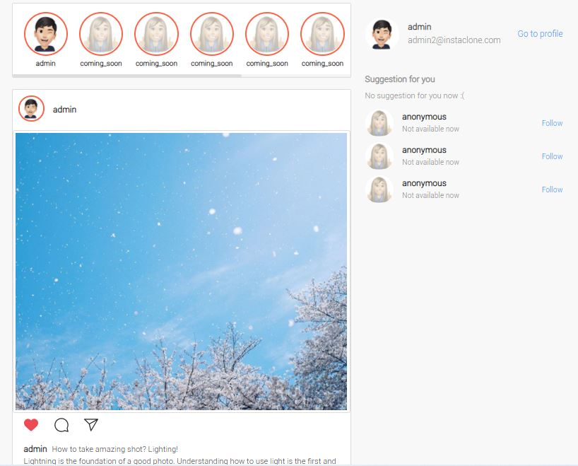
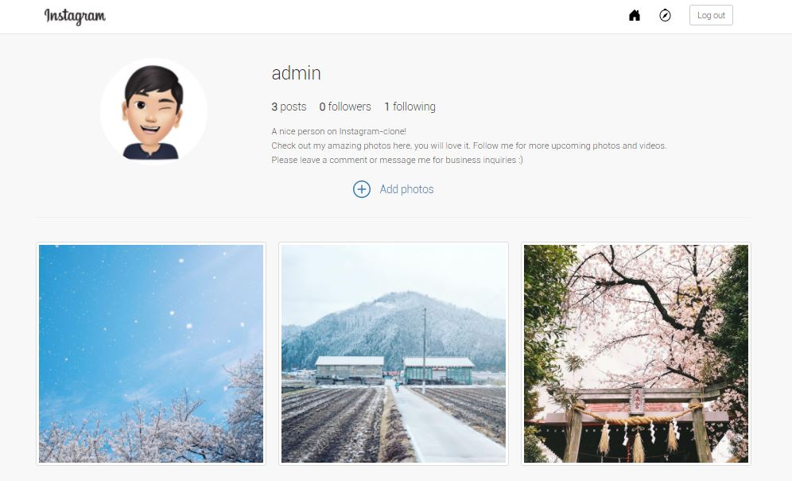

# Instaclone, a photo sharing web application

This is a web application I built as a side project to improve my web development skills. For the backend,it is built with Go as the primary language and PostgreSQL for the database. For the frontend, it is mainly built with Go's html/template library, along with some Bootstrap components. The UI uses [Instagram Web App](http://www.instagram.com "Instagram Web App")'s design as reference.

## Live Demo
Check it out at https://instaclone.ngtingsheng.com/. 
- Index page:  
  
- Profile page:  

## Deployment
The application is currently deployed to Digital Ocean, running on top of Caddy web server. Caddy web server is an open source web server with multiple advantages: it is easy to configure, provides HTTP/2 support and also have a conveneint SSL configuration with Let’s Encrypt. Therefore, these are the reason I am using it instead of the more common ones like Nginx or Apache. 

## Todo list
While Instagram is a LARGE application. It may take a serious amount of time to build up the entire thing. Here is a list of todos to keep track of my progress.

### Security
- [x] Securing from Cross-Site Request Forgery (CSRF)
- [x] Securing from cookie tampering
- [x] Securing from Cross site scripting (XSS)
- [x] Securing server with SSL(https)
- [x] Removing configuration and environment files from code base
- [ ] Exploring and learning more security features to add in

### Features
- [x] User registration and login
- [x] Authentication system
- [x] Cookies session with Remember token
- [x] Data validation before form posting
- [x] Gallery CRUD operation
- [x] Image CRUD operation
- [x] Render dynamic notification alerts
- [x] Redirect URL to improve user experience
- [ ] Mailgun for email services
- [ ] Resetting user password
- [ ] Caption for each image
- [ ] Followers and following function
- [ ] Index page that shows gallery images from "followings"

#### Last update on: 21/11/2020
